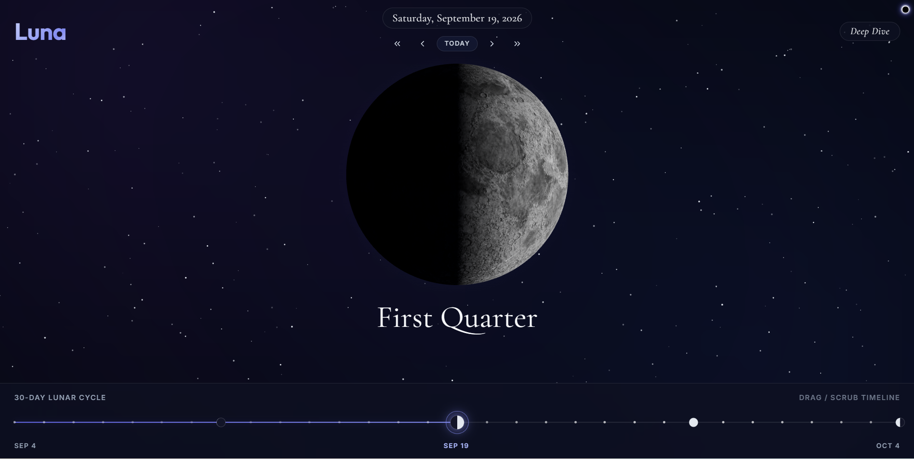
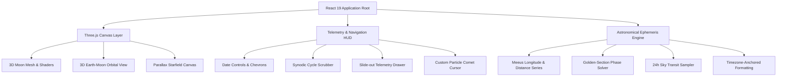

<div align="center">



# L U N A

### *An Immersive Celestial Lunar Ephemeris & 3D Orbital Explorer*

### [**▶  LAUNCH LUNA**](https://kavindu-rakn.github.io/Luna/)

[](https://github.com/kavindu-rakn/Luna/actions/workflows/ci.yml)
[](./LICENSE)


<p align="center">
  <a href="#overview">OVERVIEW</a> &nbsp;|&nbsp;
  <a href="#features">FEATURES</a> &nbsp;|&nbsp;
  <a href="#logic">LOGIC</a> &nbsp;|&nbsp;
  <a href="#keybindings">KEYBINDINGS</a> &nbsp;|&nbsp;
  <a href="#architecture">ARCHITECTURE</a> &nbsp;|&nbsp;
  <a href="#cloning">CLONING</a> &nbsp;|&nbsp;
  <a href="#license">LICENSE</a>
</p>

---

</div>

<a id="overview"></a>
## | | | O V E R V I E W

**Luna** is an astronomical web application that visualizes the Moon's phase cycles, surface imagery, orbital mechanics, and transit telemetry. Blending WebGL graphics with periodic-term ephemeris algorithms, Luna provides an exploration of our nearest celestial neighbor.

```text
🌑        🌒        🌓        🌔         🌕        🌖         🌗         🌘       🌑
New      Waxing     First     Waxing       Full     Waning      Last       Waxing     New
Moon    Crescent   Quarter    Gibbous      Moon     Gibbous    Quarter    Crescent    Moon
┼──────────┼──────────┼──────────┼──────────┼──────────┼──────────┼──────────┼──────────┼
0         25         50         75         100         75         50         25        100
```

---

<a id="features"></a>
## | | | F E A T U R E S

<table>
<tr>
<td width="50%" valign="top">

### 3D Photographic Lunar Sphere
* **Photographic Albedo Map:** A 1024x512 equirectangular lunar albedo texture on a 128-segment sphere, lit by a directional sun vector derived from the true phase angle. Depth reads from the terminator; no elevation or displacement data ships with the project.
* **360° Free Drag & Inertia:** Smooth spherical rotational momentum with physics decay.
* **Seamless Polar Antialiasing:** Canvas-level polar blending eliminates equirectangular starburst artifacts.

</td>
<td width="50%" valign="top">

### Exact Quarter Phase Jumps
* **Deterministic Phase Stepping:** Step directly through the 4 primary quarter phases (*New, 1st Q, Full, Last Q*).
* **Golden-Section Search:** Minimises the circular cosine distance $\min (1 - \cos(2\pi(\theta - \theta_0)))$ over a 72-hour bracket to land on the instant the Moon reaches each target elongation. Measured within ~1.4 minutes of published values.

</td>
</tr>
<tr>
<td width="50%" valign="top">

### 3D Earth-Moon Orbital Geometry
* **Dynamic Sun-Earth-Moon Alignment:** 3D orbit model placing the Moon at the selected date's elongation around a fixed Earth, with sunlight arriving from a constant direction.
* **Orbital Telemetry:** Phase name, illuminated percentage, and Earth-Moon distance from a 60-term Meeus series, tracked against the perigee/apogee extremes.

</td>
<td width="50%" valign="top">

### 24-Hour Continuous Sky Ephemeris
* **Altitude Transit Curve:** 48-point sampling of the Moon's altitude across the selected date, anchored to local midnight at the observing location and labelled in that location's timezone.
* **Tropical & Sidereal Zodiac:** Both readings derived from the Moon's apparent ecliptic longitude, with the Lahiri ayanamsa applied for the sidereal sign.

</td>
</tr>
<tr>
<td width="50%" valign="top">

### Custom Dark Glass Calendar
* **Glassmorphic Month Matrix:** Non-native monthly calendar modal for instant date jumping.
* **Fixed Six-Week Grid:** The month matrix always renders six rows, so the modal keeps one height whether a month spans four rows or six.

</td>
<td width="50%" valign="top">

### Celestial Particle Comet Cursor
* **Dynamic Plasma Tail:** Multi-stage particle comet trailing mouse velocity.
* **Difference-Blending Core:** Inverts celestial canvas elements for tactile hover feedback.

</td>
</tr>
</table>

---

<a id="logic"></a>
## | | | L O G I C

### Astronomical Mathematical Engine

#### 1. Phase from True Elongation

Phase is defined by the Moon's angular distance east of the Sun along the ecliptic, not by how much of the disc appears lit:

$D(t) = \lambda_{\text{moon}}(t) - \lambda_{\odot}(t) \pmod{360°}$

with $D = 0°$ at New Moon, $90°$ at First Quarter, $180°$ at Full and $270°$ at Last Quarter. Both longitudes come from Meeus periodic-term series (ch. 47 for the Moon, ch. 25 for the Sun). $D$ advances monotonically at about $12.19°$/day, so it is continuous through New Moon and reaches every target exactly. An illumination-derived phase does neither: it skips across zero and never attains the exact quarter values.

#### 2. Circular Phase Angular Distance Metric
To avoid standard New Moon seam discontinuities ($0.999 \leftrightarrow 0.001$), target quarter phases $k \in \{0, 1, 2, 3\}$ ($p_0 = k \times 0.25$) are optimized using a continuous cosine distance function:

$$\mathcal{D}(t) = 1 - \cos\left(2\pi \cdot \big(\text{Phase}(t) - p_0\big)\right)$$

#### 3. Golden-Section Extremum Search
For an initial interval $[a, b]$ over a 72-hour window, the target instant is resolved via golden-ratio contractions ($\phi = \frac{1 + \sqrt{5}}{2}$):

$$x_1 = a + (2 - \phi)(b - a), \quad x_2 = b - (2 - \phi)(b - a)$$

Iterating for 28 steps contracts the bracket to:

$\Delta t_{\text{bracket}} = \frac{259{,}200\text{ s}}{\phi^{28}} \approx 0.34\text{ seconds}$

That figure is the **convergence of the search**, not the accuracy of the answer. What bounds the result is the ephemeris model underneath it.

#### 4. Measured Accuracy

| Quantity | Method | Checked against | Result |
| :--- | :--- | :--- | :--- |
| New Moon instant | Elongation $D = 0°$, golden-section | Published conjunctions for the 2017 and 2024 total solar eclipses | within **1.4 min** |
| Ecliptic longitude | Meeus ch. 47, 60 terms + additive terms | Same eclipse conjunctions | ~**0.01°** |
| Earth-Moon distance | Meeus ch. 47 radius series | Accepted perigee/apogee extremes | min **356,571**, max **406,691**, mean **385,023** km |
| Quarter-phase landing | Golden-section on the cosine metric | Target elongations | **0.00 arcmin** |
| Moonrise / moonset | 10-minute horizon scan, bisected to the second | Refraction-corrected altitude crossing zero | consistent with the plotted curve by construction |

All times are rendered in the observing location's timezone rather than the viewer's device timezone.

---

<a id="keybindings"></a>
## | | | K E Y B I N D I N G S

Luna is built with a keyboard navigation system:

| Key Binding | Action | Description |
| :--- | :--- | :--- |
| <kbd>→</kbd> | **Next Day** | Step time forward by +1 solar day |
| <kbd>←</kbd> | **Previous Day** | Step time backward by -1 solar day |
| <kbd>Shift</kbd> + <kbd>→</kbd> | **Next Major Phase** | Jump to the computed instant of the next primary quarter (*New ➔ 1st Q ➔ Full ➔ Last Q*) |
| <kbd>Shift</kbd> + <kbd>←</kbd> | **Previous Major Phase** | Jump to the computed instant of the preceding primary quarter (*Last Q ➔ Full ➔ 1st Q ➔ New*) |
| <kbd>T</kbd> | **Realtime Reset** | Snap back to current date & time |
| <kbd>D</kbd> | **Deep Dive** | Toggle astronomical telemetry drawer |
| <kbd>Esc</kbd> | **Dismiss** | Close modals, drawer, and popups |

---

<a id="architecture"></a>
## | | | A R C H I T E C T U R E



* **Frontend:** React 19, Vite
* **3D Graphics:** Three.js, React Three Fiber (`@react-three/fiber`), Drei (`@react-three/drei`)
* **Motion & Physics:** GSAP (`@gsap/react`), custom spring momentum decay
* **Ephemeris Calculations:** Meeus periodic-term series (lunar longitude & distance, solar longitude), SunCalc (topocentric altitude/azimuth), golden-section and bisection root finding
* **Typography:** *Cormorant Garamond* (Serif), *Outfit* (Heading), *Inter* (Sans), *JetBrains Mono* (Tabular Numeric)
* **Icons:** Lucide React

---

<a id="cloning"></a>
## | | | C L O N I N G

### Prerequisites
* **Node.js**: v18.0.0 or higher
* **npm** / **pnpm** / **yarn**

### Installation

```bash
# Clone the repository
git clone https://github.com/kavindu-rakn/Luna.git

# Navigate into project directory
cd Luna

# Install dependencies
npm install
```

### Development Server

```bash
npm run dev
```

Visit `http://localhost:5173/Luna/` in your browser.

### Production Build

```bash
# Build production bundle
npm run build

# Preview production build locally
npm run preview
```

### Tests

```bash
# Run the ephemeris test suite once
npm test

# Re-run on change
npm run test:watch
```

The suite runs under `TZ=Asia/Colombo` on purpose. Astronomy is computed for a
location, so no displayed value may depend on the machine clock; a bare
`toLocaleTimeString()` would pass on a UTC CI runner but fails here.

The assertions are checked by mutation testing: each fixed bug is reintroduced in
turn and the suite must fail. All eight are caught.

---

<a id="license"></a>
## | | | L I C E N S E

Released under the [MIT License](./LICENSE). © 2026 Kavindu Ranathunga.

---

<div align="center">

```text
══════════════════════════════════════════════════════ ◆ ══════════════════════════════════════════════════════
   
      ██╗  ██╗ █████╗ ██╗   ██╗██╗███╗   ██╗██████╗ ██╗   ██╗        ██████╗  █████╗ ██╗  ██╗███╗   ██╗
      ██║ ██╔╝██╔══██╗██║   ██║██║████╗  ██║██╔══██╗██║   ██║        ██╔══██╗██╔══██╗██║ ██╔╝████╗  ██║
      █████╔╝ ███████║██║   ██║██║██╔██╗ ██║██║  ██║██║   ██║ █████╗ ██████╔╝███████║█████╔╝ ██╔██╗ ██║
      ██╔═██╗ ██╔══██║╚██╗ ██╔╝██║██║╚██╗██║██║  ██║██║   ██║ ╚════╝ ██╔══██╗██╔══██║██╔═██╗ ██║╚██╗██║
      ██║  ██╗██║  ██║ ╚████╔╝ ██║██║ ╚████║██████╔╝╚██████╔╝        ██║  ██║██║  ██║██║  ██╗██║ ╚████║
      ╚═╝  ╚═╝╚═╝  ╚═╝  ╚═══╝  ╚═╝╚═╝  ╚═══╝╚═════╝  ╚═════╝         ╚═╝  ╚═╝╚═╝  ╚═╝╚═╝  ╚═╝╚═╝  ╚═══╝
   
══════════════════════════════════════════════════════ ◆ ═══════════════════════════════════════════════════════
```

<sub>Crafted with astronomical curiosity & creative web design.</sub>

</div>
