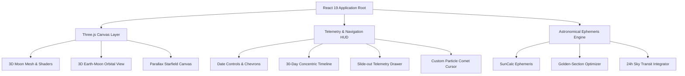

<div align="center">


# L U N A

### *An Immersive Celestial Lunar Ephemeris & 3D Orbital Explorer*


<p align="center">
  <a href="#overview">OVERVIEW</a> &nbsp;|&nbsp;
  <a href="#features">FEATURES</a> &nbsp;|&nbsp;
  <a href="#logic">LOGIC</a> &nbsp;|&nbsp;
  <a href="#keybindings">KEYBINDINGS</a> &nbsp;|&nbsp;
  <a href="#architecture">ARCHITECTURE</a> &nbsp;|&nbsp;
  <a href="#cloning">CLONING</a>
</p>

---

</div>

<a id="overview"></a>
## | | | O V E R V I E W

**Luna** is an astronomical web application that visualizes the Moon's phase cycles, 3D surface topography, orbital mechanics, and transit telemetry. Blending high-performance WebGL graphics with astronomical ephemeris algorithms, Luna provides an exploration of our nearest celestial neighbor.

```text
🌑        🌒        🌓        🌔         🌕        🌖         🌗         🌘       🌑
New      Waxing     First     Waxing       Full     Waning      Last       Waxing     New
Moon    Crescent   Quarter    Gibbous      Moon     Gibbous    Quarter    Crescent    Moon
┼──────────┼──────────┼──────────┼──────────┼──────────┼──────────┼──────────┼──────────┼
0         25         50         75         100         75         50         25        100
```

---

<a id="features"></a>
## | | | F E A T U R E S

<table>
<tr>
<td width="50%" valign="top">

### 3D Photographic Lunar Sphere
* **High-Res USGS Albedo & Relief:** Rendered with Three.js (`@react-three/fiber`) with realistic terminator shadows.
* **360° Free Drag & Inertia:** Smooth spherical rotational momentum with physics decay.
* **Seamless Polar Antialiasing:** Canvas-level polar blending eliminates equirectangular starburst artifacts.

</td>
<td width="50%" valign="top">

### Sub-Second Quarter Phase Jumps
* **Deterministic Phase Stepping:** Step directly through the 4 primary quarter phases (*New, 1st Q, Full, Last Q*).
* **Golden-Section Search:** Solves the circular cosine distance $\min (1 - \cos(2\pi(\theta - \theta_0)))$ to pinpoint exact astronomical seconds.

</td>
</tr>
<tr>
<td width="50%" valign="top">

### 3D Earth-Moon Orbital Geometry
* **Dynamic Sun-Earth-Moon Alignment:** Real-time 3D orbit model showing Earth's position relative to the solar vector.
* **Orbital Telemetry:** Displays phase name, percentage illumination, and true Earth-Moon distance in kilometers.

</td>
<td width="50%" valign="top">

### 24-Hour Continuous Sky Ephemeris
* **Real-time Elevation Curve:** 48-point transit path plotting the Sun and Moon through the local celestial sphere.
* **Astrological & Ecliptic Zodiac:** True sidereal and tropical zodiac calculations with apogee/perigee proximity tracking.

</td>
</tr>
<tr>
<td width="50%" valign="top">

### Custom Dark Glass Calendar
* **Glassmorphic Month Matrix:** Non-native monthly calendar modal for instant date jumping.
* **Zero Layout Shift:** Rigid geometric containers guarantee stable rendering across all 30 lunar days.

</td>
<td width="50%" valign="top">

### Celestial Particle Comet Cursor
* **Dynamic Plasma Tail:** Multi-stage particle comet trailing mouse velocity.
* **Difference-Blending Core:** Inverts celestial canvas elements for tactile hover feedback.

</td>
</tr>
</table>

---

<a id="logic"></a>
## | | | L O G I C

### Astronomical Mathematical Engine

#### 1. Circular Phase Angular Distance Metric
To avoid standard New Moon seam discontinuities ($0.999 \leftrightarrow 0.001$), target quarter phases $k \in \{0, 1, 2, 3\}$ ($p_0 = k \times 0.25$) are optimized using a continuous cosine distance function:

$$\mathcal{D}(t) = 1 - \cos\left(2\pi \cdot \big(\text{Phase}(t) - p_0\big)\right)$$

#### 2. Golden-Section Extremum Search
For an initial interval $[a, b]$ over a 72-hour window, the exact minute is resolved via golden-ratio contractions ($\phi = \frac{1 + \sqrt{5}}{2}$):

$$x_1 = a + (2 - \phi)(b - a), \quad x_2 = b - (2 - \phi)(b - a)$$

Iterating for 28 steps yields sub-second precision:

$$\Delta t_{\text{precision}} = \frac{259{,}200\text{ s}}{\phi^{28}} \approx 0.34\text{ seconds}$$

---

<a id="keybindings"></a>
## | | | K E Y B I N D I N G S

Luna is built with a keyboard navigation system:

| Key Binding | Action | Description |
| :--- | :--- | :--- |
| <kbd>→</kbd> | **Next Day** | Step time forward by +1 solar day |
| <kbd>←</kbd> | **Previous Day** | Step time backward by -1 solar day |
| <kbd>Shift</kbd> + <kbd>→</kbd> | **Next Major Phase** | Jump to exact minute of next primary quarter (*New ➔ 1st Q ➔ Full ➔ Last Q*) |
| <kbd>Shift</kbd> + <kbd>←</kbd> | **Previous Major Phase** | Jump to exact minute of preceding primary quarter (*Last Q ➔ Full ➔ 1st Q ➔ New*) |
| <kbd>T</kbd> | **Realtime Reset** | Snap back to current date & time |
| <kbd>D</kbd> | **Deep Dive** | Toggle astronomical telemetry drawer |
| <kbd>Esc</kbd> | **Dismiss** | Close modals, drawer, and popups |

---

<a id="architecture"></a>
## | | | A R C H I T E C T U R E



* **Frontend:** React 19, Vite
* **3D Graphics:** Three.js, React Three Fiber (`@react-three/fiber`), Drei (`@react-three/drei`)
* **Motion & Physics:** GSAP (`@gsap/react`), custom spring momentum decay
* **Ephemeris Calculations:** SunCalc, custom Keplerian orbit solvers
* **Typography:** *Cormorant Garamond* (Serif), *Outfit* (Heading), *Inter* (Sans), *JetBrains Mono* (Tabular Numeric)
* **Icons:** Lucide React

---

<a id="cloning"></a>
## | | | C L O N I N G

### Prerequisites
* **Node.js**: v18.0.0 or higher
* **npm** / **pnpm** / **yarn**

### Installation

```bash
# Clone the repository
git clone https://github.com/kavindu-rakn/Luna.git

# Navigate into project directory
cd Luna

# Install dependencies
npm install
```

### Development Server

```bash
npm run dev
```

Visit `http://localhost:5173/Luna/` in your browser.

### Production Build

```bash
# Build production bundle
npm run build

# Preview production build locally
npm run preview
```

---

<div align="center">

```text
══════════════════════════════════════════════════════ ◆ ══════════════════════════════════════════════════════
   
      ██╗  ██╗ █████╗ ██╗   ██╗██╗███╗   ██╗██████╗ ██╗   ██╗        ██████╗  █████╗ ██╗  ██╗███╗   ██╗
      ██║ ██╔╝██╔══██╗██║   ██║██║████╗  ██║██╔══██╗██║   ██║        ██╔══██╗██╔══██╗██║ ██╔╝████╗  ██║
      █████╔╝ ███████║██║   ██║██║██╔██╗ ██║██║  ██║██║   ██║ █████╗ ██████╔╝███████║█████╔╝ ██╔██╗ ██║
      ██╔═██╗ ██╔══██║╚██╗ ██╔╝██║██║╚██╗██║██║  ██║██║   ██║ ╚════╝ ██╔══██╗██╔══██║██╔═██╗ ██║╚██╗██║
      ██║  ██╗██║  ██║ ╚████╔╝ ██║██║ ╚████║██████╔╝╚██████╔╝        ██║  ██║██║  ██║██║  ██╗██║ ╚████║
      ╚═╝  ╚═╝╚═╝  ╚═╝  ╚═══╝  ╚═╝╚═╝  ╚═══╝╚═════╝  ╚═════╝         ╚═╝  ╚═╝╚═╝  ╚═╝╚═╝  ╚═╝╚═╝  ╚═══╝
   
══════════════════════════════════════════════════════ ◆ ═══════════════════════════════════════════════════════
```

<sub>Crafted with astronomical curiosity & creative web design.</sub>

</div>
