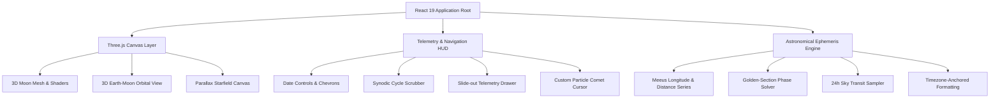

<div align="center">


# L U N A

### *An Immersive Celestial Lunar Ephemeris & 3D Orbital Explorer*

### [**▶  LAUNCH LUNA**](https://kavindu-rakn.github.io/Luna/)

[](https://github.com/kavindu-rakn/Luna/actions/workflows/ci.yml)
[](./LICENSE)


<p align="center">
  <a href="#overview">OVERVIEW</a> &nbsp;|&nbsp;
  <a href="#features">FEATURES</a> &nbsp;|&nbsp;
  <a href="#logic">LOGIC</a> &nbsp;|&nbsp;
  <a href="#keybindings">KEYBINDINGS</a> &nbsp;|&nbsp;
  <a href="#sharing">SHARING</a> &nbsp;|&nbsp;
  <a href="#offline">OFFLINE</a> &nbsp;|&nbsp;
  <a href="#privacy">PRIVACY</a> &nbsp;|&nbsp;
  <a href="#architecture">ARCHITECTURE</a> &nbsp;|&nbsp;
  <a href="#cloning">CLONING</a> &nbsp;|&nbsp;
  <a href="#license">LICENSE</a>
</p>

---

</div>

<a id="overview"></a>
## | | | O V E R V I E W

**Luna** is an astronomical web application that visualizes the Moon's phase cycles, surface imagery, orbital mechanics, and transit telemetry. Blending WebGL graphics with periodic-term ephemeris algorithms, Luna provides an exploration of our nearest celestial neighbor.

```text
🌑        🌒        🌓        🌔         🌕        🌖         🌗         🌘       🌑
New      Waxing     First     Waxing       Full     Waning      Last       Waxing     New
Moon    Crescent   Quarter    Gibbous      Moon     Gibbous    Quarter    Crescent    Moon
┼──────────┼──────────┼──────────┼──────────┼──────────┼──────────┼──────────┼──────────┼
0         25         50         75         100         75         50         25        100
```

---

<a id="features"></a>
## | | | F E A T U R E S

<table>
<tr>
<td width="50%" valign="top">

### 3D Photographic Lunar Sphere
* **Photographic Albedo Map:** A 1024x512 equirectangular lunar albedo texture on a 128-segment sphere, lit by a directional sun vector derived from the true phase angle. Depth reads from the terminator; no elevation or displacement data ships with the project.
* **360° Free Drag & Inertia:** Smooth spherical rotational momentum with physics decay.
* **Seamless Polar Antialiasing:** Canvas-level polar blending eliminates equirectangular starburst artifacts.

</td>
<td width="50%" valign="top">

### Exact Quarter Phase Jumps
* **Deterministic Phase Stepping:** Step directly through the 4 primary quarter phases (*New, 1st Q, Full, Last Q*).
* **Golden-Section Search:** Minimises the circular cosine distance $\min (1 - \cos(2\pi(\theta - \theta_0)))$ over a 72-hour bracket to land on the instant the Moon reaches each target elongation. Measured within ~1.4 minutes of published values.

</td>
</tr>
<tr>
<td width="50%" valign="top">

### 3D Earth-Moon Orbital Geometry
* **Dynamic Sun-Earth-Moon Alignment:** 3D orbit model placing the Moon at the selected date's elongation around a fixed Earth, with sunlight arriving from a constant direction.
* **Orbital Telemetry:** Phase name, illuminated percentage, and Earth-Moon distance from a 60-term Meeus series, tracked against the perigee/apogee extremes.

</td>
<td width="50%" valign="top">

### 24-Hour Continuous Sky Ephemeris
* **Altitude Transit Curve:** 48-point sampling of the Moon's altitude across the selected date, anchored to local midnight at the observing location and labelled in that location's timezone.
* **Location Picker:** Search any place on Earth, star the ones you return to, and have its IANA timezone resolved offline from the coordinates.
* **Your Clock, Your Units:** Times on a 12- or 24-hour clock and distances in kilometres or miles, starting from whatever your device uses and remembered on it.
* **Tropical & Sidereal Zodiac:** Both readings derived from the Moon's apparent ecliptic longitude, with the Lahiri ayanamsa applied for the sidereal sign.

</td>
</tr>
<tr>
<td width="50%" valign="top">

### Custom Dark Glass Calendar
* **Glassmorphic Month Matrix:** Non-native monthly calendar modal for instant date jumping.
* **Month & Year Pickers:** Go straight to any month from 1900 to 2100, or type a year to jump to it.
* **A Moon on Every Day:** Each day shows its phase at local noon, the days of New, First Quarter, Full and Last Quarter Moons are ringed, and the month's exact phase times sit below, each one click from its precise moment.
* **Fixed Six-Week Grid:** The month matrix always renders six rows, so the modal keeps one height whether a month spans four rows or six.

</td>
<td width="50%" valign="top">

### Celestial Particle Comet Cursor
* **Dynamic Plasma Tail:** Multi-stage particle comet trailing mouse velocity.
* **Difference-Blending Core:** Inverts celestial canvas elements for tactile hover feedback.

</td>
</tr>
</table>

---

<a id="logic"></a>
## | | | L O G I C

### Astronomical Mathematical Engine

#### 1. Phase from True Elongation

Phase is defined by the Moon's angular distance east of the Sun along the ecliptic, not by how much of the disc appears lit:

$D(t) = \lambda_{\text{moon}}(t) - \lambda_{\odot}(t) \pmod{360°}$

with $D = 0°$ at New Moon, $90°$ at First Quarter, $180°$ at Full and $270°$ at Last Quarter. Both longitudes come from Meeus periodic-term series (ch. 47 for the Moon, ch. 25 for the Sun). $D$ advances monotonically at about $12.19°$/day, so it is continuous through New Moon and reaches every target exactly. An illumination-derived phase does neither: it skips across zero and never attains the exact quarter values.

#### 2. Circular Phase Angular Distance Metric
To avoid standard New Moon seam discontinuities ($0.999 \leftrightarrow 0.001$), target quarter phases $k \in \{0, 1, 2, 3\}$ ($p_0 = k \times 0.25$) are optimized using a continuous cosine distance function:

$$\mathcal{D}(t) = 1 - \cos\left(2\pi \cdot \big(\text{Phase}(t) - p_0\big)\right)$$

#### 3. Golden-Section Extremum Search
For an initial interval $[a, b]$ over a 72-hour window, the target instant is resolved via golden-ratio contractions ($\phi = \frac{1 + \sqrt{5}}{2}$):

$$x_1 = a + (2 - \phi)(b - a), \quad x_2 = b - (2 - \phi)(b - a)$$

Iterating for 28 steps contracts the bracket to:

$\Delta t_{\text{bracket}} = \frac{259{,}200\text{ s}}{\phi^{28}} \approx 0.34\text{ seconds}$

That figure is the **convergence of the search**, not the accuracy of the answer. What bounds the result is the ephemeris model underneath it.

#### 4. Measured Accuracy

| Quantity | Method | Checked against | Result |
| :--- | :--- | :--- | :--- |
| New Moon instant | Elongation $D = 0°$, golden-section | Published conjunctions for the 2017 and 2024 total solar eclipses | within **1.4 min** |
| Ecliptic longitude | Meeus ch. 47, 60 terms + additive terms | Same eclipse conjunctions | ~**0.01°** |
| Earth-Moon distance | Meeus ch. 47 radius series | Accepted perigee/apogee extremes | min **356,571**, max **406,691**, mean **385,023** km |
| Quarter-phase landing | Golden-section on the cosine metric | Target elongations | **0.00 arcmin** |
| Moonrise / moonset | 10-minute horizon scan, bisected to the second | Refraction-corrected altitude crossing zero | consistent with the plotted curve by construction |

All times are rendered in the observing location's timezone rather than the viewer's device timezone.

---

<a id="keybindings"></a>
## | | | K E Y B I N D I N G S

Luna is built with a keyboard navigation system:

| Key Binding | Action | Description |
| :--- | :--- | :--- |
| <kbd>→</kbd> | **Next Day** | Step time forward by +1 solar day |
| <kbd>←</kbd> | **Previous Day** | Step time backward by -1 solar day |
| <kbd>Shift</kbd> + <kbd>→</kbd> | **Next Major Phase** | Jump to the computed instant of the next primary quarter (*New ➔ 1st Q ➔ Full ➔ Last Q*) |
| <kbd>Shift</kbd> + <kbd>←</kbd> | **Previous Major Phase** | Jump to the computed instant of the preceding primary quarter (*Last Q ➔ Full ➔ 1st Q ➔ New*) |
| <kbd>T</kbd> | **Realtime Reset** | Snap back to current date & time |
| <kbd>D</kbd> | **Deep Dive** | Toggle astronomical telemetry drawer |
| <kbd>Esc</kbd> | **Dismiss** | Close modals, drawer, and popups |
| <kbd>?</kbd> | **Shortcuts** | Show every shortcut, including the timeline and calendar keys |

---

<a id="sharing"></a>
## | | | S H A R I N G

Every view has a link. The address bar always describes what is on screen, and the link button copies it.

```text
https://kavindu-rakn.github.io/Luna/?d=2026-09-26T16:50Z&at=64.15,-21.94&n=Reykjavik,+Iceland&tz=Atlantic/Reykjavik
```

| Param | Meaning |
| :--- | :--- |
| `d` | The instant, to the minute, in UTC. A bare day such as `2026-09-26` is read as local noon at the location. |
| `at` | Latitude and longitude, rounded to two decimals (about a kilometre). |
| `n` | Place name, for display. |
| `tz` | IANA timezone. If missing or invalid it is resolved from the coordinates. |

**Live views carry no date.** `d` only appears once you step, scrub or jump. Bookmark Luna while it follows the real clock and the bookmark keeps showing tonight's Moon, rather than freezing on the moment you saved it. Press <kbd>T</kbd> or **Today** to go live again.

**Opening someone's link does not change your saved place.** It shows their view; the bare URL still returns you to yours.

Every parameter is treated as untrusted and validated on its own, so a malformed field is dropped without discarding the rest of the link.

---

<a id="offline"></a>
## | | | O F F L I N E

Luna is an installable app and works with no connection. Every calculation already runs on the device, so after one visit the app, the 3D engine and the Moon texture are cached, and it opens on a hillside with no signal.

* **What works offline:** everything except searching for a new place. Saved places still work, since their timezone is resolved locally from the coordinates. Shared links open too.
* **What stays out of the cache:** the share-card image, install icons and font subsets for scripts the UI does not use, which trims the first-visit download from 3.1 MB to 1.9 MB. The Earth texture is cached the first time the drawer opens.
* **Updates never interrupt you.** A new version installs in the background and waits. A notice offers to reload; until you do, you keep a complete and consistent copy of the version you are using.

---

<a id="privacy"></a>
## | | | P R I V A C Y

Luna has no accounts, cookies, analytics or ads, and every calculation runs on the device. The **Privacy** link in the app says all of this in full, beside a button that forgets everything Luna has stored.

* **Your location** is asked for only when you press *Use my location*, and is rounded to about a kilometre the moment it arrives. The exact position is never stored, sent or put in a link. The rounded position is sent to OpenStreetMap's Nominatim to name the place.
* **Place search** sends what you type to Nominatim, which, like any web service, sees your IP address.
* **Stored on the device:** your chosen place, saved places, clock and distance settings, and the name of the last place located. Older versions also kept a name for every place ever located; that history is deleted on the first visit after updating.
* **Share links** carry the date, the place name and coordinates rounded to about a kilometre.

---

<a id="architecture"></a>
## | | | A R C H I T E C T U R E



* **Frontend:** React 19, Vite
* **3D Graphics:** Three.js, React Three Fiber (`@react-three/fiber`), Drei (`@react-three/drei`)
* **Motion & Physics:** GSAP (`@gsap/react`), custom spring momentum decay
* **Ephemeris Calculations:** Meeus periodic-term series (lunar longitude & distance, solar longitude), SunCalc (topocentric altitude/azimuth), golden-section and bisection root finding
* **Typography:** *Cormorant Garamond* (Serif), *Outfit* (Heading), *Inter* (Sans), *JetBrains Mono* (Tabular Numeric)
* **Icons:** Lucide React

---

<a id="cloning"></a>
## | | | C L O N I N G

### Prerequisites
* **Node.js**: 20.19 or newer, or 22.12 or newer (Vite 8's minimum)
* **npm** / **pnpm** / **yarn**

### Installation

```bash
# Clone the repository
git clone https://github.com/kavindu-rakn/Luna.git

# Navigate into project directory
cd Luna

# Install dependencies
npm install
```

### Development Server

```bash
npm run dev
```

Visit `http://localhost:5173/Luna/` in your browser. The `/Luna/` path follows the site URL, so it changes if you set `SITE_URL` (see [Deploying](#deploying)).

### Production Build

```bash
# Build production bundle
npm run build

# Preview production build locally
npm run preview
```

<a id="deploying"></a>
### Deploying

Luna is a static site: `npm run build` writes everything to `dist/`, and any static host can serve it. The one thing a build has to know is the address it will live at, because the files are served from that path and social cards need full URLs. That address is worked out in this order:

| Where it is built | Address used |
| :--- | :--- |
| Anywhere, with `SITE_URL` set | exactly that, e.g. `SITE_URL=https://luna.example.com/ npm run build` |
| Netlify | the deploy's own URL, previews included |
| Vercel | the production domain, or the preview's URL |
| Cloudflare Pages | the deployment URL |
| GitHub Actions | the repository's GitHub Pages site, so a fork publishes to its own |
| Anywhere else | `https://kavindu-rakn.github.io/Luna/`, from `homepage` in `package.json` |

Set `SITE_URL` for a custom domain, including a custom domain on GitHub Pages, which serves from the root rather than from `/Luna/`. The Node version comes from `.nvmrc` and `engines` in `package.json`, which these hosts read.

GitHub Pages cannot send response headers, so the content security policy is embedded in the page. On Netlify and Cloudflare Pages, `public/_headers` adds the ones a page cannot set for itself, including clickjacking protection.

### Tests

```bash
# Run the ephemeris test suite once
npm test

# Re-run on change
npm run test:watch
```

The suite runs under `TZ=Asia/Colombo` on purpose. Astronomy is computed for a
location, so no displayed value may depend on the machine clock; a bare
`toLocaleTimeString()` would pass on a UTC CI runner but fails here.

The assertions are checked by mutation testing: each fixed bug is reintroduced in
turn and the suite must fail. All eight are caught.

### Performance Budget

```bash
npm run build && npm run check:bundle
```

Three.js, fiber and drei are about 60% of Luna's JavaScript, but only the two 3D scenes need them, so they load on demand behind the loading screen. The first-paint chunk is **111 KB gzipped**, down from 354 KB.

CI fails the build if that chunk crosses 130 KB, if the 3D engine is preloaded by the document, or if the entry imports it statically. That last case is not hypothetical: a chunking change once pulled React into the 3D chunk, which made the entry look *smaller* while forcing all of Three.js back onto the critical path.

If WebGL is unavailable or a scene fails to download, that scene gives way to a 2D Moon drawn at the correct phase and everything else keeps working.

---

<a id="license"></a>
## | | | L I C E N S E

Released under the [MIT License](./LICENSE). © 2026 Kavindu Ranathunga.

---

<div align="center">

```text
══════════════════════════════════════════════════════ ◆ ══════════════════════════════════════════════════════
   
      ██╗  ██╗ █████╗ ██╗   ██╗██╗███╗   ██╗██████╗ ██╗   ██╗        ██████╗  █████╗ ██╗  ██╗███╗   ██╗
      ██║ ██╔╝██╔══██╗██║   ██║██║████╗  ██║██╔══██╗██║   ██║        ██╔══██╗██╔══██╗██║ ██╔╝████╗  ██║
      █████╔╝ ███████║██║   ██║██║██╔██╗ ██║██║  ██║██║   ██║ █████╗ ██████╔╝███████║█████╔╝ ██╔██╗ ██║
      ██╔═██╗ ██╔══██║╚██╗ ██╔╝██║██║╚██╗██║██║  ██║██║   ██║ ╚════╝ ██╔══██╗██╔══██║██╔═██╗ ██║╚██╗██║
      ██║  ██╗██║  ██║ ╚████╔╝ ██║██║ ╚████║██████╔╝╚██████╔╝        ██║  ██║██║  ██║██║  ██╗██║ ╚████║
      ╚═╝  ╚═╝╚═╝  ╚═╝  ╚═══╝  ╚═╝╚═╝  ╚═══╝╚═════╝  ╚═════╝         ╚═╝  ╚═╝╚═╝  ╚═╝╚═╝  ╚═╝╚═╝  ╚═══╝
   
══════════════════════════════════════════════════════ ◆ ═══════════════════════════════════════════════════════
```

<sub>Crafted with astronomical curiosity & creative web design.</sub>

</div>
