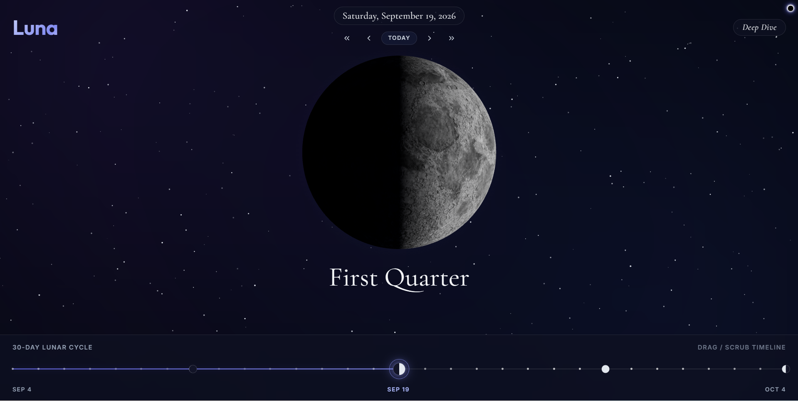
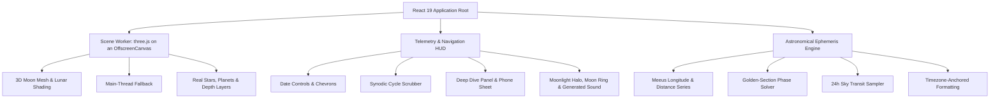

<div align="center">



# L U N A

### *An Immersive Celestial Lunar Ephemeris & 3D Orbital Explorer*

### [**▶  LAUNCH LUNA**](https://luna-kvn.vercel.app/)

[](https://github.com/kavindu-rakn/Luna/actions/workflows/ci.yml)
[](./LICENSE)


<p align="center">
  <a href="#overview">OVERVIEW</a> &nbsp;|&nbsp;
  <a href="#features">FEATURES</a> &nbsp;|&nbsp;
  <a href="#logic">LOGIC</a> &nbsp;|&nbsp;
  <a href="#keybindings">KEYBINDINGS</a> &nbsp;|&nbsp;
  <a href="#sharing">SHARING</a> &nbsp;|&nbsp;
  <a href="#offline">OFFLINE</a> &nbsp;|&nbsp;
  <a href="#privacy">PRIVACY</a> &nbsp;|&nbsp;
  <a href="#architecture">ARCHITECTURE</a> &nbsp;|&nbsp;
  <a href="#cloning">CLONING</a> &nbsp;|&nbsp;
  <a href="#license">LICENSE</a>
</p>

---

</div>

<a id="overview"></a>
## | | | O V E R V I E W

**Luna** is an astronomical web application that visualizes the Moon's phase cycles, surface imagery, orbital mechanics, and transit telemetry. Blending WebGL graphics with periodic-term ephemeris algorithms, Luna provides an exploration of our nearest celestial neighbor.

```text
🌑        🌒        🌓        🌔         🌕        🌖         🌗         🌘       🌑
New      Waxing     First     Waxing       Full     Waning      Last       Waxing     New
Moon    Crescent   Quarter    Gibbous      Moon     Gibbous    Quarter    Crescent    Moon
┼──────────┼──────────┼──────────┼──────────┼──────────┼──────────┼──────────┼──────────┼
0         25         50         75         100         75         50         25        100
```

---

<a id="features"></a>
## | | | F E A T U R E S

<table>
<tr>
<td width="50%" valign="top">

### 3D Photographic Lunar Sphere
* **As It Stands in Your Sky:** The disc is turned as it appears from the chosen place and time, zenith up (the parallactic angle and the tilt of the Moon's axis), lit from the Sun's true direction, and nodding with the real libration of the moment, so a month of scrubbing shows the edges come and go.
* **NASA Imagery:** The colour of NASA's Lunar Reconnaissance Orbiter (the 2025 CGI Moon Kit) with relief from LOLA laser altimetry, so craters and mountains catch the light along the terminator and flatten towards full, as on the real Moon. GPU-compressed KTX2 textures: 2K everywhere, 4K on large screens.
* **Lunar Light:** A shader of its own: Lommel-Seeliger reflectance, the way lunar dust scatters light, so a crescent keeps its true width and the full Moon is evenly bright to its edge, a small opposition surge near full, faint earthshine around thin crescents, and a soft glow off the lit limb.
* **360° Free Drag & Inertia:** Drag to turn the Moon with momentum; the turn stays as an offset on the true orientation, and a double-click or double-tap springs it back.
* **The Real Sky Behind It:** The 5,080 stars the eye can see (the Bright Star Catalogue, to magnitude 6) and the five naked-eye planets, placed where they really are around the Moon, turned to your horizon, and coloured by temperature. The Moon is drawn far larger than its true half degree, as in a composite photograph, so the sky is an 80° field around it. A bright star twinkles now and then, more strongly when it is low. The constellation behind the Moon is named in its screen-reader label.
* **Depth You Can Feel:** The Moon holds still and the sky slides behind it, the faintest stars furthest back and moving most, as if your eye moved around the Moon. It follows the mouse on a desktop and the phone's tilt (*Tilt to look around*), on a spring that recentres once the phone settles.
* **Off the Main Thread:** The scene is plain three.js in a Web Worker drawing to an OffscreenCanvas where the browser supports it, and on the main thread elsewhere. It draws only when something changes.

</td>
<td width="50%" valign="top">

### Exact Quarter Phase Jumps
* **Deterministic Phase Stepping:** Step directly through the 4 primary quarter phases (*New, 1st Q, Full, Last Q*).
* **Golden-Section Search:** Minimises the circular cosine distance $\min (1 - \cos(2\pi(\theta - \theta_0)))$ over a 72-hour bracket to land on the instant the Moon reaches each target elongation. Measured within ~1.4 minutes of published values.

</td>
</tr>
<tr>
<td width="50%" valign="top">

### Deep Dive, in Three Chapters
* **The Moon:** How much is lit and how old the Moon is, in the serif, then its distance from a 60-term Meeus series on a perigee-to-apogee scale, its zodiac sign and the countdown to the next exact phase.
* **Tonight:** The Moon's altitude through the place's day on one chart, with the Sun's day fading through civil, nautical and astronomical twilight behind it, moonrise and moonset marked on the curve and its highest point timed to the minute. Drag across the chart, or use the arrow keys on it, to move through the day. Below it: moonrise and moonset with the way to look, sunrise and sunset.
* **The Orbit:** A crisp SVG diagram from above Earth's north pole, placing the Moon at its elongation, and how far east or west of the Sun that puts it.
* **Each Number Once:** In quiet cards, each label above its value. Values change at once while you scrub and fade in softly after a single step.

</td>
<td width="50%" valign="top">

### Your Place, Your Clock
* **A Day That Belongs to the Place:** The chart runs from local midnight to local midnight at the observing location, in its own time zone, a 23- or 25-hour day included.
* **Location Picker:** Search any place on Earth, star the ones you return to, and have its IANA timezone resolved offline from the coordinates.
* **Your Clock, Your Units:** Times on a 12- or 24-hour clock and distances in kilometres or miles, starting from whatever your device uses and remembered on it.
* **Tropical & Sidereal Zodiac:** Both readings derived from the Moon's apparent ecliptic longitude, with the Lahiri ayanamsa applied for the sidereal sign.

</td>
</tr>
<tr>
<td width="50%" valign="top">

### A Quiet Stage
* **Nothing but the Moon:** The header holds the wordmark, the date block and one menu. The date opens the calendar, the place beneath it opens the location picker, and five controls step by phase and by day, with ⊙ lit in amber while the view follows the clock. The phase name opens Deep Dive.
* **A Dock for the Thumb:** On a phone held upright only the wordmark and the menu stay at the top. The date, the place and the five controls sit at the foot of the screen with the timeline, within reach of a thumb.
* **One Cycle to Scrub:** The timeline is one lunar month, New Moon to New Moon, drawn in hairlines with a tick for every day. Let go near an exact phase and the thumb settles into it, with a tick on Android; tap a phase icon to land on its exact moment. The thumb pulses amber only while following the clock, and on a first visit it nudges once to show it moves.
* **Deep Dive Beside the Moon:** On a wide screen Deep Dive is a panel on the right, and the whole stage re-centres beside it, so the Moon and the timeline are never cut off. On a phone a slim grabber sits above the dock: lift it, or tap the phase name, and Deep Dive rises as a sheet that stops above the dock, so you can still step through the days or scrub through the month and watch every number change. Swipe it down to put it away.
* **One Menu:** Deep Dive, sharing, Sound, *Tilt to look around* on phones, keyboard shortcuts where there is a keyboard, privacy, and the 12/24-hour and km/mile settings.
* **Calendar:** A monthly calendar for instant date jumping. On a wide screen it grows out of the date and hangs beneath it; on a phone it rises from the bottom, within reach of a thumb.
* **Month & Year Pickers:** Go straight to any month from 1900 to 2100, or type a year to jump to it.
* **A Moon on Every Day:** Each day shows its phase at local noon, the days of New, First Quarter, Full and Last Quarter Moons are ringed, and the month's exact phase times sit below, each one click from its precise moment.
* **One Overlay System:** The calendar, the location picker, the menu, the shortcuts and privacy open above everything, Deep Dive included. Popovers grow out of the control that opened them; on a phone each is a sheet you can swipe down. <kbd>Esc</kbd> or a tap outside closes the top one, and focus goes back where it came from.

</td>
<td width="50%" valign="top">

### Moonlight and Sound
* **A Moonlight Halo:** With a mouse, a soft light trails the pointer across the sky, brightening the stars inside it, and steps aside over controls and text. The pointer itself stays.
* **A Ring on the Moon:** Over the Moon a hairline ring stands in for the pointer: *Drag to rotate* the first time, *Double-click to reset* once it's turned.
* **A Meteor, Now and Then:** Fling the pointer fast across empty sky and a meteor may streak along its path. At most once every 45 seconds.
* **Sound, Generated:** Off until you turn it on. Every sound is synthesised in the browser, with no audio files: a glass tap on presses, a tick for each day crossed pitched by how much of the Moon is lit, each exact phase's own chime, and a quiet ambient bed that brightens toward Full Moon.

</td>
</tr>
</table>

---

<a id="logic"></a>
## | | | L O G I C

### Astronomical Mathematical Engine

#### 1. Phase from True Elongation

Phase is defined by the Moon's angular distance east of the Sun along the ecliptic, not by how much of the disc appears lit:

$D(t) = \lambda_{\text{moon}}(t) - \lambda_{\odot}(t) \pmod{360°}$

with $D = 0°$ at New Moon, $90°$ at First Quarter, $180°$ at Full and $270°$ at Last Quarter. Both longitudes come from Meeus periodic-term series (ch. 47 for the Moon, ch. 25 for the Sun). $D$ advances monotonically at about $12.19°$/day, so it is continuous through New Moon and reaches every target exactly. An illumination-derived phase does neither: it skips across zero and never attains the exact quarter values.

#### 2. Circular Phase Angular Distance Metric
To avoid standard New Moon seam discontinuities ($0.999 \leftrightarrow 0.001$), target quarter phases $k \in \{0, 1, 2, 3\}$ ($p_0 = k \times 0.25$) are optimized using a continuous cosine distance function:

$$\mathcal{D}(t) = 1 - \cos\left(2\pi \cdot \big(\text{Phase}(t) - p_0\big)\right)$$

#### 3. Golden-Section Extremum Search
For an initial interval $[a, b]$ over a 72-hour window, the target instant is resolved via golden-ratio contractions ($\phi = \frac{1 + \sqrt{5}}{2}$):

$$x_1 = a + (2 - \phi)(b - a), \quad x_2 = b - (2 - \phi)(b - a)$$

Iterating for 28 steps contracts the bracket to:

$\Delta t_{\text{bracket}} = \frac{259{,}200\text{ s}}{\phi^{28}} \approx 0.34\text{ seconds}$

That figure is the **convergence of the search**, not the accuracy of the answer. What bounds the result is the ephemeris model underneath it.

#### 4. Measured Accuracy

| Quantity | Method | Checked against | Result |
| :--- | :--- | :--- | :--- |
| New Moon instant | Elongation $D = 0°$, golden-section | Published conjunctions for the 2017 and 2024 total solar eclipses | within **1.4 min** |
| Ecliptic longitude | Meeus ch. 47, 60 terms + additive terms | Same eclipse conjunctions | ~**0.01°** |
| Earth-Moon distance | Meeus ch. 47 radius series | Accepted perigee/apogee extremes | min **356,571**, max **406,691**, mean **385,023** km |
| Quarter-phase landing | Golden-section on the cosine metric | Target elongations | **0.00 arcmin** |
| Moonrise / moonset | 10-minute horizon scan, bisected to the second | Refraction-corrected altitude crossing zero | consistent with the plotted curve by construction |

All times are rendered in the observing location's timezone rather than the viewer's device timezone.

---

<a id="keybindings"></a>
## | | | K E Y B I N D I N G S

Luna is built with a keyboard navigation system:

| Key Binding | Action | Description |
| :--- | :--- | :--- |
| <kbd>→</kbd> | **Next Day** | Step time forward by +1 solar day |
| <kbd>←</kbd> | **Previous Day** | Step time backward by -1 solar day |
| <kbd>Shift</kbd> + <kbd>→</kbd> | **Next Major Phase** | Jump to the computed instant of the next primary quarter (*New ➔ 1st Q ➔ Full ➔ Last Q*) |
| <kbd>Shift</kbd> + <kbd>←</kbd> | **Previous Major Phase** | Jump to the computed instant of the preceding primary quarter (*Last Q ➔ Full ➔ 1st Q ➔ New*) |
| <kbd>T</kbd> | **Realtime Reset** | Snap back to current date & time |
| <kbd>D</kbd> | **Deep Dive** | Open or close Deep Dive |
| <kbd>Esc</kbd> | **Dismiss** | Close the top dialog, popover or sheet, then Deep Dive |
| <kbd>?</kbd> | **Shortcuts** | Show every shortcut, including the timeline and calendar keys |

---

<a id="sharing"></a>
## | | | S H A R I N G

Every view has a link. The address bar always describes what is on screen, and the link button copies it.

```text
https://luna-kvn.vercel.app/?d=2026-09-26T16:50Z&at=64.15,-21.94&n=Reykjavik,+Iceland&tz=Atlantic/Reykjavik
```

| Param | Meaning |
| :--- | :--- |
| `d` | The instant, to the minute, in UTC. A bare day such as `2026-09-26` is read as local noon at the location. |
| `at` | Latitude and longitude, rounded to two decimals (about a kilometre). |
| `n` | Place name, for display. |
| `tz` | IANA timezone. If missing or invalid it is resolved from the coordinates. |

**Live views carry no date.** `d` only appears once you step, scrub or jump. Bookmark Luna while it follows the real clock and the bookmark keeps showing tonight's Moon, rather than freezing on the moment you saved it. Press <kbd>T</kbd> or **Today** to go live again.

**Opening someone's link does not change your saved place.** It shows their view; the bare URL still returns you to yours.

Every parameter is treated as untrusted and validated on its own, so a malformed field is dropped without discarding the rest of the link.

---

<a id="offline"></a>
## | | | O F F L I N E

Luna is an installable app and works with no connection. Every calculation already runs on the device, so after one visit the app, the 3D engine, the 2K Moon textures and the star catalogue are cached, and it opens on a hillside with no signal.

* **What works offline:** everything except searching for a new place. Saved places still work, since their timezone is resolved locally from the coordinates. Shared links open too.
* **What stays out of the cache:** the share-card image, install icons and font subsets for scripts the UI does not use. The 4K Moon texture, for large screens, and the image textures, for browsers that can't decode KTX2, are cached the first time they are used.
* **Updates never interrupt you.** A new version installs in the background and waits. A notice offers to reload; until you do, you keep a complete and consistent copy of the version you are using.

---

<a id="privacy"></a>
## | | | P R I V A C Y

Luna has no accounts, cookies, analytics or ads, and every calculation runs on the device. The **Privacy** link in the app says all of this in full, beside a button that forgets everything Luna has stored.

* **Your location** is asked for only when you press *Use my location*, and is rounded to about a kilometre the moment it arrives. The exact position is never stored, sent or put in a link. The rounded position is sent to OpenStreetMap's Nominatim to name the place.
* **Place search** sends what you type to Nominatim, which, like any web service, sees your IP address.
* **Motion:** on a phone the sky drifts with its tilt, read from the motion sensor; the readings move the sky and are never stored or sent. On an iPhone it starts only from *Tilt to look around*, in the menu, and iOS asks first.
* **Stored on the device:** your chosen place, saved places, clock and distance settings, whether sound and tilt are on, whether the Moon has been turned yet (so *Drag to rotate* shows once), and the name of the last place located. Older versions also kept a name for every place ever located; that history is deleted on the first visit after updating.
* **Share links** carry the date, the place name and coordinates rounded to about a kilometre.

---

<a id="architecture"></a>
## | | | A R C H I T E C T U R E


```mermaid
graph TD
    A[React 19 Application Root] --> B[Scene Worker: three.js on an OffscreenCanvas]
    A --> C[Telemetry & Navigation HUD]
    A --> D[Astronomical Ephemeris Engine]

    B --> B1[3D Moon Mesh & Lunar Shading]
    B --> B2[Main-Thread Fallback]
    B --> B3[Real Stars, Planets & Depth Layers]

    C --> C1[Date Controls & Chevrons]
    C --> C2[Synodic Cycle Scrubber]
    C --> C3[Deep Dive Panel & Phone Sheet]
    C --> C4[Moonlight Halo, Moon Ring & Generated Sound]

    D --> D1[Meeus Longitude & Distance Series]
    D --> D2[Golden-Section Phase Solver]
    D --> D3[24h Sky Transit Sampler]
    D --> D4[Timezone-Anchored Formatting]
```

* **Frontend:** React 19, Vite
* **3D Graphics:** Three.js, in a Web Worker with an OffscreenCanvas where supported
* **Motion & Physics:** CSS transitions and the Web Animations API, springs for the sky's depth layers and the moonlight halo, momentum for the Moon's spin
* **Ephemeris Calculations:** Meeus periodic-term series (lunar longitude & distance, solar longitude), SunCalc (topocentric altitude/azimuth), golden-section and bisection root finding, JPL's Keplerian elements for the planets
* **Typography:** *Cormorant Garamond* (phase names, dates, wordmark), *Inter* (everything else, with tabular figures)
* **Icons:** Luna's own set, drawn for it on a 24 px grid with 1.25 px strokes (`src/components/icons/`)

---

<a id="cloning"></a>
## | | | C L O N I N G

### Prerequisites
* **Node.js**: 20.19 or newer, or 22.12 or newer (Vite 8's minimum)
* **npm** / **pnpm** / **yarn**

### Installation

```bash
# Clone the repository
git clone https://github.com/kavindu-rakn/Luna.git

# Navigate into project directory
cd Luna

# Install dependencies
npm install
```

### Development Server

```bash
npm run dev
```

Visit `http://localhost:5173/Luna/` in your browser. The `/Luna/` path follows the site URL, so it changes if you set `SITE_URL` (see [Deploying](#deploying)).

### Production Build

```bash
# Build production bundle
npm run build

# Preview production build locally
npm run preview
```

<a id="deploying"></a>
### Deploying

Luna is a static site: `npm run build` writes everything to `dist/`, and any static host can serve it. The one thing a build has to know is the address it will live at, because the files are served from that path and social cards need full URLs. That address is worked out in this order:

| Where it is built | Address used |
| :--- | :--- |
| Anywhere, with `SITE_URL` set | exactly that, e.g. `SITE_URL=https://luna.example.com/ npm run build` |
| Netlify | the deploy's own URL, previews included |
| Vercel | the production domain, or the preview's URL |
| Cloudflare Pages | the deployment URL |
| GitHub Actions | the repository's GitHub Pages site, so a fork publishes to its own |
| Anywhere else | `https://kavindu-rakn.github.io/Luna/`, from `homepage` in `package.json` |

Set `SITE_URL` for a custom domain, including a custom domain on GitHub Pages, which serves from the root rather than from `/Luna/`. The Node version comes from `.nvmrc` and `engines` in `package.json`, which these hosts read.

The content security policy is embedded in the page, since it carries the hash of the one inline script and GitHub Pages cannot send headers at all. On Vercel, `vercel.json` adds the headers a page cannot set for itself, including clickjacking protection, plus long-lived caching for hashed files; `public/_headers` does the same on Netlify and Cloudflare Pages.

### Tests

```bash
# Run the ephemeris test suite once
npm test

# Re-run on change
npm run test:watch
```

The suite runs under `TZ=Asia/Colombo` on purpose. Astronomy is computed for a
location, so no displayed value may depend on the machine clock; a bare
`toLocaleTimeString()` would pass on a UTC CI runner but fails here.

The assertions are checked by mutation testing: each fixed bug is reintroduced in
turn and the suite must fail. All eight are caught.

### Performance Budget

```bash
npm run build && npm run check:bundle
```

The page paints before any JavaScript arrives. The build renders the app's first frame to HTML with the stylesheet inlined, and a 2 KB inline script brings its date, phase and flat Moon up to today before the first paint. The live app then replaces it, and the 3D Moon fades in over the flat one once its texture is drawn. There is no loading screen.

Three.js is most of Luna's JavaScript, but only the 3D Moon needs it. It loads after the first paint inside the scene's worker, where it parses, compiles and draws without touching the main thread; browsers whose workers can't draw WebGL load it on the main thread instead. Deep Dive's chapters, the keyboard shortcuts and the privacy notice also load after first paint. The entry chunk is **84 KB gzipped**, down from 354 KB.

CI fails the build if that chunk crosses 90 KB, if the prerendered first frame is missing, if the content security policy doesn't allow the inline script by its hash, if the 3D engine is preloaded by the document, or if the entry imports it statically. That last case is not hypothetical: a chunking change once pulled React into the 3D chunk, which made the entry look *smaller* while forcing all of Three.js back onto the critical path.

If WebGL is unavailable or the scene fails to download, the 2D Moon stays, drawn at the correct phase and tilt, and everything else keeps working.

---

<a id="license"></a>
## | | | L I C E N S E

Released under the [MIT License](./LICENSE). © 2026 Kavindu Ranathunga.

Moon textures from NASA's Scientific Visualization Studio, [CGI Moon Kit](https://svs.gsfc.nasa.gov/4720) (LRO colour and LOLA elevation), in the public domain. They are rebuilt with `node scripts/textures/build.mjs`.

Stars from the Bright Star Catalogue, 5th revised edition (Hoffleit & Warren, 1991, NASA Astronomical Data Center), and constellation boundaries from Roman (1987, *PASP* 99, 695), both through the [VizieR catalogue service](https://vizier.cds.unistra.fr/) at CDS, Strasbourg ([V/50](https://cdsarc.cds.unistra.fr/viz-bin/cat/V/50), [VI/42](https://cdsarc.cds.unistra.fr/viz-bin/cat/VI/42)). They are rebuilt with `node scripts/sky/build.mjs`. Planet positions from JPL's [Keplerian elements for approximate positions of the major planets](https://ssd.jpl.nasa.gov/planets/approx_pos.html) (Standish & Williams).

---

<div align="center">

```text
══════════════════════════════════════════════════════ ◆ ══════════════════════════════════════════════════════
   
      ██╗  ██╗ █████╗ ██╗   ██╗██╗███╗   ██╗██████╗ ██╗   ██╗        ██████╗  █████╗ ██╗  ██╗███╗   ██╗
      ██║ ██╔╝██╔══██╗██║   ██║██║████╗  ██║██╔══██╗██║   ██║        ██╔══██╗██╔══██╗██║ ██╔╝████╗  ██║
      █████╔╝ ███████║██║   ██║██║██╔██╗ ██║██║  ██║██║   ██║ █████╗ ██████╔╝███████║█████╔╝ ██╔██╗ ██║
      ██╔═██╗ ██╔══██║╚██╗ ██╔╝██║██║╚██╗██║██║  ██║██║   ██║ ╚════╝ ██╔══██╗██╔══██║██╔═██╗ ██║╚██╗██║
      ██║  ██╗██║  ██║ ╚████╔╝ ██║██║ ╚████║██████╔╝╚██████╔╝        ██║  ██║██║  ██║██║  ██╗██║ ╚████║
      ╚═╝  ╚═╝╚═╝  ╚═╝  ╚═══╝  ╚═╝╚═╝  ╚═══╝╚═════╝  ╚═════╝         ╚═╝  ╚═╝╚═╝  ╚═╝╚═╝  ╚═╝╚═╝  ╚═══╝
   
══════════════════════════════════════════════════════ ◆ ═══════════════════════════════════════════════════════
```

<sub>Crafted with astronomical curiosity & creative web design.</sub>

</div>
